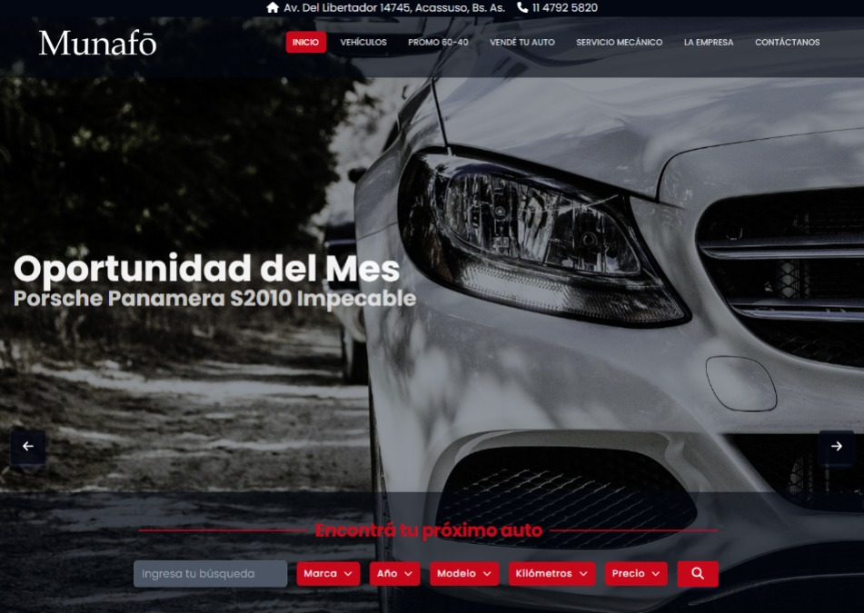

# Munafó Argentina
Munafó's website is developed with React. In this project I participated as frontend developer, I had the responsibility to layout the entire website, apply the logic for filters and routing. 

## Table of contents

- [Munafó Argentina](#munafó-argentina)
  - [Table of contents](#table-of-contents)
  - [Overview](#overview)
    - [The website](#the-website)
    - [Screenshots](#screenshots)
  - [Website live](#website-live)
  - [My process](#my-process)
  - [Author](#author)

# Overview
## The Website 
Munafó Argentina's website corresponds to a car dealership. It has different sections where you can see the advantages of the dealership, see the cars available for sale and schedule an appointment to access the mechanical services of the dealership. 
## Screenshots

Desktop Version

Mobile Version

# [Website live](https://concesionario-arg.vercel.app/)
## My process

React + TailwindCSS was used for the development of this website. The approach was to work using reusable components in the website to take advantage of working with a framework like React. 

